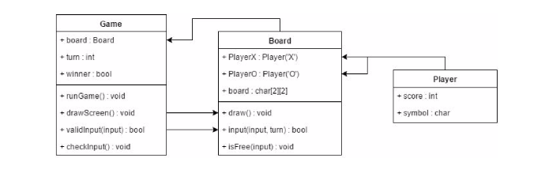
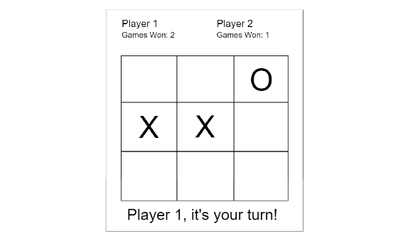

# Late-term Assignment: Design report
Reykjavík University, Department of Computer Science

Fall semesester 2016, Software Engineering T-303-HUGB

**Students:**

- Andri Karel Júlíusson
- Axel Björnsson
- Guðjón Steinar Sverrison
- Gunnar Davíð Gunnarsson
- Hlynur Stefánsson
- Sigurður Marteinn Lárusson
- Smári Björn Gunnarsson

### Class Diagram

This is our initial *class diagram*. It is of course subject to change and is mostly a guideline for us to work with at the start.

### Prototype

